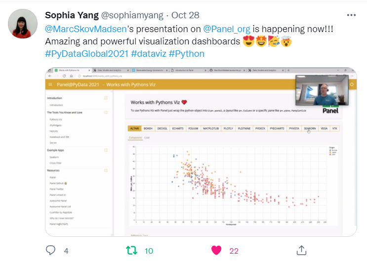

# 👍 Awesome Panel - Introduction to Panel

[Panel](https://panel.holoviz.org) is a very powerful framework for exploratory data analysis and for creating beautiful data science apps in Python.

This repository contains code and other material to support introductory talks, training and videos on Panel.


Check it out

Resource | Video | Notebooks | App |
|--------|-------|-----------|-----|
| Presentation | [Youtube](https://youtu.be/dUaS7yM2FxA) | [](https://mybinder.org/v2/gh/marcskovmadsen/awesome-panel-introduction/main?urlpath=lab/tree/presentation) | [](https://mybinder.org/v2/gh/marcskovmadsen/awesome-panel-introduction/main?urlpath=panel/introduction) |

For more inspiration check out my site [awesome-panel.org](https://awesome-panel.org)

## Installation

```bash
pip install -r requirements.txt
jupyter serverextension enable panel.io.jupyter_server_extension
```

## Run the presentation

```bash
panel serve presentation/*.py
```

If you are developing the presentation you can add the `--autoreload` flag.

Please note

- the app is optimized for a screen size of 1980x1024.
- On Windows `cmd.exe` will not *expand* `presentation/*.py` into a list of files. You will have to expand the list of apps manually

```bash
panel serve presentation/introduction.py seaborn_typer.py ...
```

or use powershell, wsl, git bash or similar.

## Talks

### PyData Global 2021 - Python Dashboarding Shootout and Showdown

James A. Bednar, Adrien Treuille, Nicolas Kruchten, Marc Skov Madsen, Sylvain Corlay  |  10/28/2021 2:00 PM UTC - 10/28/2021 4:00 PM

[Agenda](https://pydata.org/global2021/schedule/presentation/140/python-dashboarding-shootout-and-showdown/), [Video | Panel Introduction 24:00 | Shootout 1:15:08](https://zoom.us/rec/share/ailBm48NBppFXaNHvU2EsnSGf3XhR8Q9mzmhUnwqkwDXS_bRlYMRgnQvudc7UeY_.pAZHOxu7L2Yl6Fr0?startTime=1635430012000), [Git Release | v1](https://github.com/MarcSkovMadsen/awesome-panel-introduction/releases/tag/v1).

For years, Python lagged behind other languages when it came to building interactive web applications. Python now has at least four full-featured, solid frameworks focused on dashboards and similar apps: Dash, Panel, Streamlit, and Voila+IPyWidgets. We'll hear presentations from proponents of each library, and then have a spirited debate and discussion: Which one is best for which purpose?

[](https://twitter.com/sophiamyang/status/1453734521799540752?s=20)